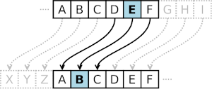
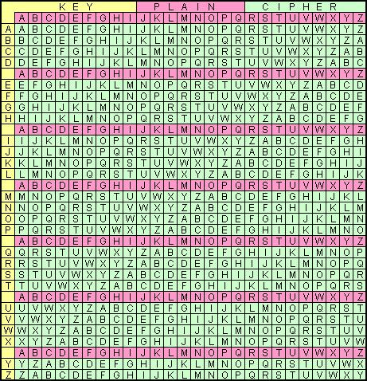
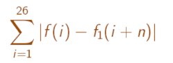

# Cracking Vigenere ciphers

[][license]

For three centuries the Vigenère cipher resisted all attempts to break it; here's how it's done.


### The Caesar cipher

In cryptography, a Caesar cipher is one of the simplest and most widely known encryption techniques.  It is a type of substitution cipher in which each letter in the plaintext is replaced by a letter some fixed number of positions down the alphabet. For example, with a left shift of `3`, the letter `D` would be replaced by `A`, the letter `E` would become `B`, and so on:



The method is named after Julius Caesar, who used it in his private correspondence.  Here's an example:

    Plaintext: attackatonce
    SHIFT: 2
    Ciphertext: yrryaiyrmlac

### The Vigenère cipher

The Vigenère cipher is a method of encrypting alphabetic text by using a series of different Caesar ciphers based on the letters of a keyword.  The cipher has been reinvented many times, the method was originally described by Giovan Battista Bellaso in 1553 however, the scheme was later misattributed to Blaise de Vigenère in the 19th century, and is now widely known as the "Vigenère cipher".

To Vigenère square can be used to help visualise encryption and decryption, it consists of the alphabet written out 26 times in different rows, each alphabet is shifted cyclically to the left compared to the previous alphabet, corresponding to the 26 possible Caesar ciphers.  At different points in the encryption process, the cipher uses a different alphabet from one of the rows.  The alphabet used at each point depends on a repeating keyword.



For example, suppose that the plaintext to be encrypted is:
`ATTACKATDAWN`

The person sending the message chooses a keyword and repeats it until it matches the length of the plaintext, for example, the keyword `LEMON`:
`LEMONLEMONLE`

Each row starts with a key letter. The remainder of the row holds the letters `A` to `Z` (in shifted order). Although there are 26 key rows shown, you will only use as many keys (different alphabets) as there are unique letters in the key string, here just 5 keys, `{L, E, M, O, N}`. For successive letters of the message, we are going to take successive letters of the key string, and encipher each message letter using its corresponding key row. Choose the next letter of the key, go along that row to find the column heading that matches the message character; the letter at the intersection of [key-row, msg-col] is the enciphered letter.

For example, the first letter of the plaintext, `A`, is paired with `L`, the first letter of the key. So use row `L` and column `A` of the Vigenère square, namely `L`. Similarly, for the second letter of the plaintext, the second letter of the key is used; the letter at row `E` and column `T` is `X`. The rest of the plaintext is enciphered in a similar fashion:

    Plaintext:  ATTACKATDAWN
    Key:    LEMONLEMONLE
    Ciphertext: LXFOPVEFRNHR

Decryption is performed by going to the row in the table corresponding to the key, finding the position of the ciphertext letter in this row, and then using the column's label as the plaintext. For example, in row `L` (from `LEMON`), the ciphertext L appears in column `A`, which is the first plaintext letter. Next we go to row `E` (from `LEMON`), locate the ciphertext `X` which is found in column `T`, thus `T` is the second plaintext letter.


### Uncrackable Vigenère ciphers

The Vigenère cipher can be used to produce 100% crack-proof ciphers.  In order to generate an uncrackable message, one must:

* Remove all unencryptable signals from the message. (For example, remove spaces and punctuation marks, and use only upper case letters.)
* Pad the message with random characters (to conceal the original message's length).
* Use a secret key that comprises only random characters.
* Use a secret key that is at least as long as the message.
* Protect the secret key.
* Never use the secret key again.

With a key length at least as long as the ciper text, the ciper text has too much entropy to be cracked.  A key could be manufactured to yield any desired result.

# Cracking Vigenère

So providing the key length is significantly shorter than the message itself we can take a shot at cracking the code.

Vigenère cipher #1:

    RTZHPSQVBNYHSTAWQJFKNYBXRMZBQZZWWNFLHQVITBRDGJGKTHUHTPLJXWYVLJNUTY
    UHRMRHZDTLGQFBDZNUTYUHRMRHZDORNXLRJFEHIMRFWJRNNGBBHBRDGJGKTHUHTPLJ
    XWYVLJNUTYUHRMRHZDTLGQFBDZNUTYUHRMRHZDORNXLRJFEHIMRFWJRNNGBBH


Vigenère cipher #2:

    TWUSITWMOMFZTESPSDSESOFZJKMTFWDISCCJVHSMTWXYGSWTDLFEFYXPCUESUPFAPBKFZJUPFDOVTMHLJKITRBZBXEJKJDGBTMPHHWMRSUPBSISMUSIZKSFGJNJPHIQNLREEJELIQNEAPWUSISAPYIPVFLGIAJOIBVEUITCTTRUPFXMELMPTJTBEIIIELRPBJNIQZFAESMELRENBDXFVFOXPBIPGSWTDMUZFLHKMTFWPNOLDBZFELUPFVMOOPQXIMKPATUBYCPNUSIKMXDVFIEELJATTKONPCXIMQWEDMXSISMKPWVAXLWDZVNMGQFOABAOPESBIPGJBZLREBIPWJOOHETESTXUMOTRBZBXEJKMLXJVBYHHZFPOUPFNLJMGAVJMTEWPNUSIKMXDTSWUPWUMEESQQMLXFLPYSUESTXFBIPOJVHZJUPFUIXACFXUPBEXIQTXEOKMLMNMEESCMLTRHWGELFRFHWQQMLXFIODAFZFOAIIUTLBDFHVJBUPRJPBGIXZJEXFV


### Finding the keyword length

The first step is to find the keyword length, this can be achieved by taking the cipher text and comparing it with shifted copies of itself to find the peak number of letter matches.

The following example illustrates a comparison of a shift of 3 for Vigenère cipher #1:

    RTZHPSQVBNYHSTAWQJFKNYBXRMZBQZZWWNFLHQVITBRDGJGKTHUHTPLJXWYVLJNUTY
       RTZHPSQVBNYHSTAWQJFKNYBXRMZBQZZWWNFLHQVITBRDGJGKTHUHTPLJXWYVLJN
                                 *

    UHRMRHZDTLGQFBDZNUTYUHRMRHZDORNXLRJFEHIMRFWJRNNGBBHBRDGJGKTHUHTPLJ
    UTYUHRMRHZDTLGQFBDZNUTYUHRMRHZDORNXLRJFEHIMRFWJRNNGBBHBRDGJGKTHUHT
    *                   *                              *

    XWYVLJNUTYUHRMRHZDTLGQFBDZNUTYUHRMRHZDORNXLRJFEHIMRFWJRNNGBBH
    PLJXWYVLJNUTYUHRMRHZDTLGQFBDZNUTYUHRMRHZDORNXLRJFEHIMRFWJRNNGBBH
              *                   *

In this case there are 5 letter matches.

If we then continue and try shifts of `4`, `5`, `6`... and so on, recording the number of matches for each.  The highest number of matches will occur for this example at a shift of `4`, this would be our guess for the key length.  Cryptosaurus simply automates this method.

This method works because under the Vigenère system a word could be encrypted using a certain part of the keyword, and then somewhere later on the same word could be encrypted using the same part of the keyword as before.  When this sort of thing happens  matching strings can be seen in the cipher text.

By shifting and comparing values there will always be random matches, however for the correct shift it is likely that there will be lots more matches because of the matching strings in the cipher text, as mentioned above.

### Finding the letters of the keyword

The next step in the process is to separate the letters in the cipher text into to groups, one group for each letter in the keyword.  If a cipher text letter would be encrypted under the second letter of the keyword it would be put into group two.

To find all of the letters of the keyword one must minimize the following summation for each letter in the keyword.



where:

`f(k)` is the frequency of the `k`th letter in the standard distribution of letters used in the English language.

`f1(k)` is the frequency in the relevant part of the cipher text.

The following table shows the standard distribution of letters used in the English language:

<table width="100%">
<thead>
<tr>
<th>A</th>
<th>B</th>
<th>C</th>
<th>D</th>
<th>E</th>
<th>F</th>
<th>G</th>
<th>H</th>
<th>I</th>
<th>J</th>
<th>K</th>
<th>L</th>
<th>M</th>
</tr>
</thead>
<tbody>
<tr>
<td>0.2%</td>
<td>1.5%</td>
<td>2.0%</td>
<td>4.3%</td>
<td>12.7%</td>
<td>2.2%</td>
<td>2.0%</td>
<td>6.1%</td>
<td>7.0%</td>
<td>0.2%</td>
<td>0.0%</td>
<td>4.0%</td>
<td>2.4%</td>
</tr>
</tbody>
</table>
<table width="100%">
<thead>
<tr>
<th>N</th>
<th>O</th>
<th>P</th>
<th>Q</th>
<th>R</th>
<th>S</th>
<th>T</th>
<th>U</th>
<th>V</th>
<th>W</th>
<th>X</th>
<th>Y</th>
<th>Z</th>
</tr>
</thead>
<tbody>
<tr>
<td>6.7%</td>
<td>7.5%</td>
<td>1.9%</td>
<td>0.1%</td>
<td>6.0%</td>
<td>6.3%</td>
<td>9.1%</td>
<td>2.8%</td>
<td>1.0%</td>
<td>2.4%</td>
<td>0.2%</td>
<td>2.0%</td>
<td>0.1%</td>
</tr>
</tbody>
</table>

The process of minimizing the summation for each letter in the keyword is shown below using Java:

#### Utility Code

```java
public class LetterFrequency{
    public LetterFrequency(boolean _filled){
        letters=new double[26];
        if(_filled){
            letters[0]=0.2; letters[1]=1.5; letters[2]=2.0; letters[3]=4.3;
            letters[4]=12.7; letters[5]=2.2; letters[6]=2.0; letters[7]=6.1;
            letters[8]=7.0; letters[9]=0.2; letters[10]=0.0; letters[11]=4.0;
            letters[12]=2.4; letters[13]=6.7; letters[14]=7.5; letters[15]=1.9;
            letters[16]=0.1; letters[17]=6.0; letters[18]=6.3; letters[19]=9.1;
            letters[20]=2.8; letters[21]=1.0; letters[22]=2.4; letters[23]=0.2;
            letters[24]=2.0; letters[25]=0.1;
        }
        else{
            letters[0]=0.0; letters[1]=0.0; letters[2]=0.0; letters[3]=0.0;
            letters[4]=0.0; letters[5]=0.0; letters[6]=0.0; letters[7]=0.0;
            letters[8]=0.0; letters[9]=0.0; letters[10]=0.0; letters[11]=0.0;
            letters[12]=0.0; letters[13]=0.0; letters[14]=0.0; letters[15]=0.0;
            letters[16]=0.0; letters[17]=0.0; letters[18]=0.0; letters[19]=0.0;
            letters[20]=0.0; letters[21]=0.0; letters[22]=0.0; letters[23]=0.0;
            letters[24]=0.0; letters[25]=0.0;
        }
    }

    public void shiftDistributionRightBy(int _shift){
        double[] temp = new double[26];
        for(int i=0;i&lt;26;i++){ temp[(i+_shift)%26]=letters[i]; }
        for(int i=0;i&lt;26;i++){ letters[i]=temp[i]; }
    }

    public void shiftDistributionLeftBy(int _shift){

        double[] temp = new double[26];
        for(int i=0;i&lt;26;i++){ temp[(i-_shift+26)%26]=letters[i]; }
        for(int i=0;i&lt;26;i++){ letters[i]=temp[i]; }
    }

    public double getMax(){
        double temp = 0.0;
        for(int i=0;i&lt;26;i++){ if(letters[i]>temp) temp=letters[i]; }
        return temp;
    };

    public int getMaxOffset(){
        double temp = 0.0;
        int counter = 0;
        for(int i=0;i&lt;26;i++){ if(letters[i]>temp) temp=letters[i]; counter = i; }
        return counter;
    };

    public void addLetter(char _let){
        switch(_let){
            case 'A': letters[0]++; break; case 'B': letters[1]++; break;
            case 'C': letters[2]++; break; case 'D': letters[3]++; break;
            case 'E': letters[4]++; break; case 'F': letters[5]++; break;
            case 'G': letters[6]++; break; case 'H': letters[7]++; break;
            case 'I': letters[8]++; break; case 'J': letters[9]++; break;
            case 'K': letters[10]++; break; case 'L': letters[11]++; break;
            case 'M': letters[12]++; break; case 'N': letters[13]++; break;
            case 'O': letters[14]++; break; case 'P': letters[15]++; break;
            case 'Q': letters[16]++; break; case 'R': letters[17]++; break;
            case 'S': letters[18]++; break; case 'T': letters[19]++; break;
            case 'U': letters[20]++; break; case 'V': letters[21]++; break;
            case 'W': letters[22]++; break; case 'X': letters[23]++; break;
            case 'Y': letters[24]++; break; case 'Z': letters[25]++; break;
        }
    }

    public void convert2percentages(){
        double temp=0.0;
        for(int i=0;i&lt;26;i++){ temp +=letters[i]; }
        for(int i=0;i&lt;26;i++){ letters[i]=(letters[i]*100)/temp; }
    }

    double[] letters;
}
```

#### The Algorithm

```java
public class Example {
    public void algorithm (){
        //INITILIZE VARIBLES
        m_Keyword="";
        m_SumOfEquationFor = new double[m_KeywordLength][26];
        m_WTABLE = new LetterFrequency[m_KeywordLength];

        //SET UP THE 26 A TABLES, THESE ARE TABLES OF THE
        //ALPHABET, SHIFTED BY 0,1,2,3... AND SO ON
        LetterFrequency A[] = new LetterFrequency[26];
        for(int i=0;i&lt;26;i++){
            A[i]=new LetterFrequency(true);
            A[i].shiftDistributionRightBy(i);
        }

        //SET UP W TABLES FOR EACH LETTER IN THE KEY LENGTH
        LetterFrequency W[] = new LetterFrequency[m_KeywordLength];
        for(int i=0;i&lt;m_KeywordLength;i++){
            //txtPlain.setText(txtPlain.getText()+"W"+i+"\n");
            _WTABLE[i] = new LetterFrequency(false);
            W[i]=new LetterFrequency(false);

            //GO THROUGH ALL THE LETTERS IN THE CIPHER TEXT THAT RELATE
            //TO THE CURRENT LETTER IN THE KEY LENGTH AND COUNT THEM
            int itemp = (m_CipherLength-i)/m_KeywordLength;
            if((m_CipherLength-i)%m_KeywordLength>0) itemp++;
            for(int j=0; j&lt;itemp; j++){
                W[i].addLetter(m_Cipher.charAt(i+j*m_KeywordLength));
            }
            W[i].convert2percentages();
            m_WTABLE[i]=W[i];

            //DO ALL THE EQUATIONS AND PUT THE RESULTS INTO m_SumOfEquation
            for(int j=0;j&lt;26;j++){ //FOR EACH SHIFT POSITION
                for(int k=0;k&lt;26;k++){ //DO THE SUM OF EQUATION
                    m_SumOfEquationFor[i][j] +=
                    Math.abs((A[j].letters[k])-(W[i].letters[k]));
                }
            }

            //WORK OUT WHICH IS THE SMALLEST RESULT AND SET THE CURRENT
            //KEY LETTER OFFSET ACCORDINGLY
            double smallestsum=m_SumOfEquationFor[i][0]+1; //FIRST VALUE PLUS 1
            for(int j=0;j&lt;26;j++){
                if(m_SumOfEquationFor[i][j]&lt;smallestsum){
                    smallestsum=m_SumOfEquationFor[i][j];
                    m_KeyletterOffset[i]=j;
                }
            }
            m_Keyword=m_Keyword+OffsetToChar(m_KeyletterOffset[i]);
            m_WTABLE[i].shiftDistributionLeftBy(m_KeyletterOffset[i]);
        }

        m_Keyword; //THE ANSWER
    }
}
```

Happy code cracking!

[license]: https://raw.githubusercontent.com/sungiant/sdf/master/LICENSE


